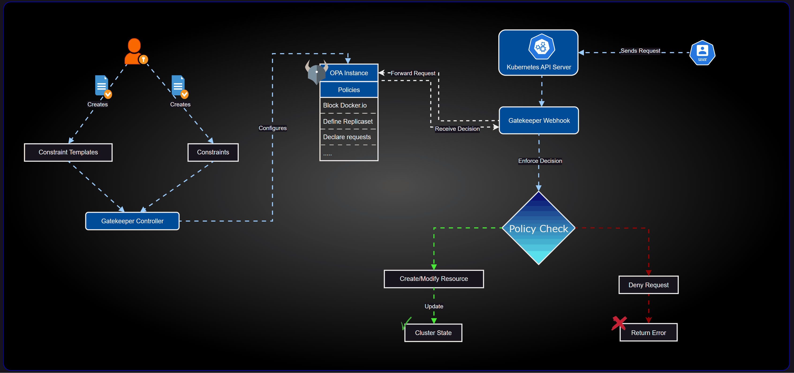

# OPA and Gatekeeper: Enhancing Kubernetes Security and Compliance

## Introduction

In the world of Kubernetes, maintaining security and compliance across clusters can be challenging. This is where Open Policy Agent (OPA) and Gatekeeper come into play. These powerful tools allow you to define and enforce policies across your Kubernetes environment, ensuring that your infrastructure adheres to best practices and organizational requirements.

## What is OPA?

Open Policy Agent (OPA) is an open-source, general-purpose policy engine that enables unified, context-aware policy enforcement across the entire stack. OPA provides a high-level declarative language called Rego for specifying policy as code and simple APIs to offload policy decision-making from your software.

## What is Gatekeeper?

Gatekeeper is a customizable admission webhook for Kubernetes that enforces policies executed by OPA. It extends Kubernetes by adding Custom Resource Definitions (CRDs) for defining and managing policies as code.

## Architecture and Workflow

Let's take a look at how OPA and Gatekeeper work together in a Kubernetes environment:



1. A user or process sends a request to the Kubernetes API server.
2. The API server forwards the request to the Gatekeeper webhook.
3. Gatekeeper evaluates the request against the defined policies (ConstraintTemplates and Constraints).
4. If the request violates any policies, it's denied. Otherwise, it's allowed to proceed.
5. The Gatekeeper controller manages the lifecycle of policies and constraints.

## Step-by-Step Guide to Implementing OPA and Gatekeeper

### Step 1: Install Gatekeeper

First, we need to install Gatekeeper in our Kubernetes cluster. We'll use Helm for this purpose.

```bash
helm repo add gatekeeper https://open-policy-agent.github.io/gatekeeper/charts
helm install gatekeeper/gatekeeper --name-template=gatekeeper --namespace gatekeeper-system --create-namespace
```

### Step 2: Define ConstraintTemplates

ConstraintTemplates define the schema and logic for our policies. Let's create a template that requires certain labels on namespaces:

```yaml
apiVersion: templates.gatekeeper.sh/v1beta1
kind: ConstraintTemplate
metadata:
  name: k8srequiredlabels
spec:
  crd:
    spec:
      names:
        kind: K8sRequiredLabels
      validation:
        openAPIV3Schema:
          properties:
            labels:
              type: array
              items: string
  targets:
    - target: admission.k8s.gatekeeper.sh
      rego: |
        package k8srequiredlabels
        violation[{"msg": msg, "details": {"missing_labels": missing}}] {
          provided := {label | input.review.object.metadata.labels[label]}
          required := {label | label := input.parameters.labels[_]}
          missing := required - provided
          count(missing) > 0
          msg := sprintf("\n%v is missing from your definition 😒😔", [missing])
        }
```

Save this as `ns_require_labels_template.yaml` and apply it:

```bash
kubectl apply -f ns_require_labels_template.yaml
```

### Step 3: Create Constraints

Now, let's create a constraint that uses our template to require a "createdby" label on namespaces:

```yaml
apiVersion: constraints.gatekeeper.sh/v1beta1
kind: K8sRequiredLabels
metadata:
  name: ns-must-have-gk
spec:
  match:
    kinds:
      - apiGroups: [""]
        kinds: ["Namespace"]
    excludedNamespaces:
    - kube-system
    - kube-public
    - kube-node-lease
    - default
    - gatekeeper-system
    - kured
  parameters:
    labels: ["createdby"]
```

Save this as `ns_Require_createdby_label_constraints.yaml` and apply it:

```bash
kubectl apply -f ns_Require_createdby_label_constraints.yaml
```

### Step 4: Test the Policy

Let's try to create a namespace without the required label:

```yaml
apiVersion: v1
kind: Namespace
metadata:
 name: badns
```

Save this as `just_another_ns.yaml` and try to apply it:

```bash
kubectl apply -f just_another_ns.yaml
```

This should be denied because it's missing the "createdby" label.

Now, let's create a namespace that complies with our policy:

```yaml
apiVersion: v1
kind: Namespace
metadata:
 name: mynamespace
 labels:
  createdby: kunal
```

Save this as `law_abiding_ns.yaml` and apply it:

```bash
kubectl apply -f law_abiding_ns.yaml
```

This should be accepted because it includes the required label.

### Step 5: Implement More Complex Policies

We can create more complex policies that cover multiple aspects of our Kubernetes resources. Here's an example that combines multiple policies:

```yaml
apiVersion: templates.gatekeeper.sh/v1beta1
kind: ConstraintTemplate
metadata:
  name: k8spolicies
spec:
  crd:
    spec:
      names:
        kind: K8sPolicies
      validation:
        openAPIV3Schema:
          properties:
            allowedRegistries:
              type: array
              items:
                type: string
  targets:
    - target: admission.k8s.gatekeeper.sh
      rego: |
        package k8spolicies

        violation[{"msg": msg}] {
          input.review.object.metadata.namespace == "default"
          msg := "🚫 Creation of resources in the 'default' namespace is prohibited! 🚷"
        }

        violation[{"msg": msg}] {
          container := input.review.object.spec.template.spec.containers[_]
          image := container.image
          not registry_allowed(image)
          msg := sprintf("🚫 Images can only be pulled from %v! 📦", [input.parameters.allowedRegistries])
        }

        violation[{"msg": msg}] {
          container := input.review.object.spec.template.spec.containers[_]
          not container.resources.limits.cpu
          msg := "🚫 Containers must have resource limits set for CPU! ⚙️"
        }

        violation[{"msg": msg}] {
          container := input.review.object.spec.template.spec.containers[_]
          not container.resources.limits.memory
          msg := "🚫 Containers must have resource limits set for memory! 🧠"
        }

        registry_allowed(image) {
          registry := input.parameters.allowedRegistries[_]
          startswith(image, registry)
        }
```

Save this as `combined_policies_template.yaml` and apply it:

```bash
kubectl apply -f combined_policies_template.yaml
```

Now, let's create a constraint that uses this template:

```yaml
apiVersion: constraints.gatekeeper.sh/v1beta1
kind: K8sPolicies
metadata:
  name: enforce-policies
spec:
  enforcementAction: deny
  match:
    kinds:
      - apiGroups: ["apps"]
        kinds: ["Deployment"]
    excludedNamespaces:
      - kube-system
      - kube-public
      - kube-node-lease
      - gatekeeper-system
  parameters:
    allowedRegistries: ["gcr.io/", "docker.io/"]
```

Save this as `combined_policies_constraints.yaml` and apply it:

```bash
kubectl apply -f combined_policies_constraints.yaml
```

### Step 6: Test the Complex Policies

Let's try to create a deployment that violates our policies:

```yaml
apiVersion: apps/v1
kind: Deployment
metadata:
  name: bad-deployment
  namespace: default
spec:
  replicas: 1
  selector:
    matchLabels:
      app: bad-app
  template:
    metadata:
      labels:
        app: bad-app
    spec:
      containers:
      - name: bad-container
        image: quay.io/bitnami/nginx:1.21.6
        ports:
        - containerPort: 80
```

Save this as `bad-deployment.yaml` and try to apply it:

```bash
kubectl apply -f bad-deployment.yaml
```

This should be denied because it violates multiple policies: it's in the default namespace, uses an image from a disallowed registry, and doesn't set resource limits.

Now, let's create a deployment that complies with our policies:

```yaml
apiVersion: apps/v1
kind: Deployment
metadata:
  name: good-nginx
  namespace: production
spec:
  replicas: 1
  selector:
    matchLabels:
      app: good-nginx
  template:
    metadata:
      labels:
        app: good-nginx
    spec:
      containers:
      - name: nginx
        image: docker.io/nginx:1.21.6
        resources:
          limits:
            cpu: "500m"
            memory: "512Mi"
        ports:
        - containerPort: 80
```

Save this as part of `good-deployment-service.yaml` and apply it:

```bash
kubectl apply -f good-deployment-service.yaml
```

This should be accepted because it complies with all our policies.

## Conclusion

OPA and Gatekeeper provide a powerful mechanism for enforcing policies in your Kubernetes clusters. By defining policies as code, you can ensure consistency, improve security, and maintain compliance across your entire infrastructure. The ability to create complex, combinatory policies allows you to address multiple concerns simultaneously, making your Kubernetes management more efficient and secure.

Remember, the policies we've demonstrated here are just the beginning. You can create policies for a wide range of use cases, from security and networking to resource management and organizational standards. As you become more familiar with OPA and Gatekeeper, you'll find countless ways to improve your Kubernetes governance.